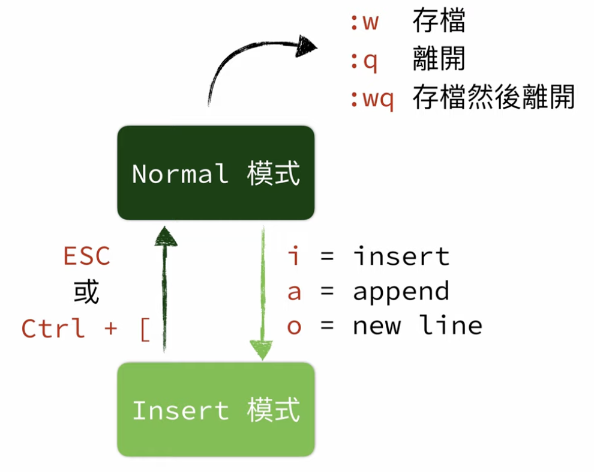

## 为什么学 Vim?

## 安装 Vim

## 开始在 Vim 里打字

## 在 Vim 里移动游标

建议：

Capslock 键改 Ctrl 键

Ctrl+Z 把 Vim 放到背景，fg 恢复。

使用 H、J、K、L 键移动游标

## Vim 之更快速、更精准的移动游标

w: 前一个单

W: 前一个词(包括标点)

b: 退一个词

B: 退一个词(包括标点)

}: 跳到下一段

{: 跳到上一段

G: 页尾

gg: 页首

0: 移到行首

$: 移到行尾

gj: 移动到区块的下一行

gk: 移动到区块的上一行

## Vim 之在文件里搜索文字

/pattern: 在文件中搜索pattern

N: 上一个匹配

n: 下一个匹配 

?pattern: 在文件中搜素pattern(反向)

N: 下一个匹配

n: 上一个匹配

:set nohlsearch: 取消匹配高亮

:set hlsearch: 匹配高亮

zz: 将当前光标所在行置到屏幕中间

zt: 将某行停在上方

zb: 将某行停在下方

fx: 往后搜索同一行最近的x

Fx: 往前搜索同一行最近的x

`*`: 搜索游标所在的字(N:上一个匹配, n:下一个匹配)

`#`: 搜索游标所在的字(N:下一个匹配, n:上一个匹配)

## Vim 之选取、复制、粘贴

注: 不要使用鼠标

按v键进入视觉模式

V: 选中一整行

y: 复制

p: 粘贴

yy: 复制一整行

## Vim 之更多关于选取、复制、粘贴

9. Vim 之编辑文字
10. Vim 之编辑多个文档 Part 1
11. Vim 之编辑多个文档 Part 2 - Buffer
12. Vim 之更多选取方式
13. Vim Text Object
14. Vim 之其他实用的小技巧
15. Vim 的配置文件 Part 1
16. Vim 的配置文件 Part 2
17. Vim 的配置文件之 Key Mapping Part 1
18. Vim 的配置文件之 Key Mapping Part 2
19. Vim 的配置文件 Part 3
20. Vim 之自动命令
21. 整理你的 Vim 配置
22. 使用 Vim 插件
23. 好用的 Vim 插件介绍 Part 1
24. 好用的 Vim 插件介绍 Part 2
25. 好用的 Vim 插件介绍 Part 3
26. 好用的 Vim 插件介绍 Part 4
27. GUI 版的 Vim
28. Vim 之动手改颜色主题
29. Vim 之 Macro
30. Vim 之其他漏网之鱼

## 推荐

## 参考

https://www.youtube.com/watch?v=u7vIywv5xBA&list=PLBd8JGCAcUAH56L2CYF7SmWJYKwHQYUDI
